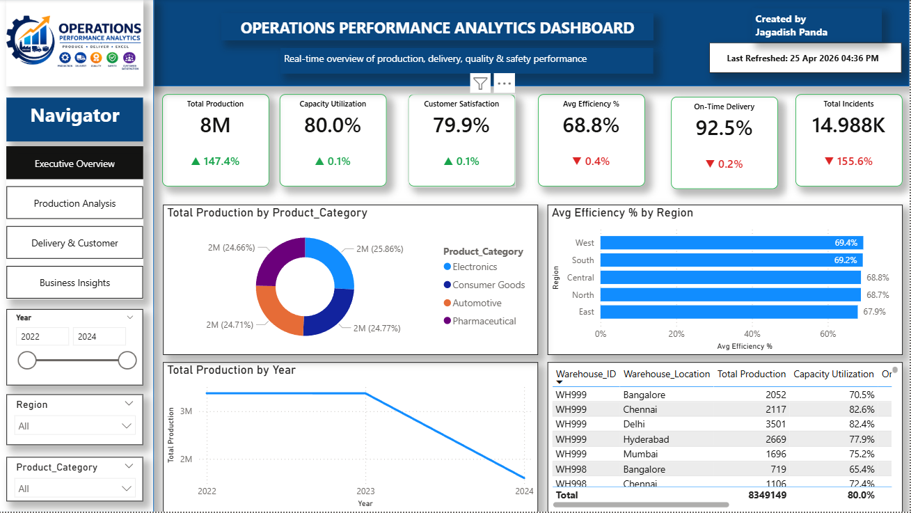
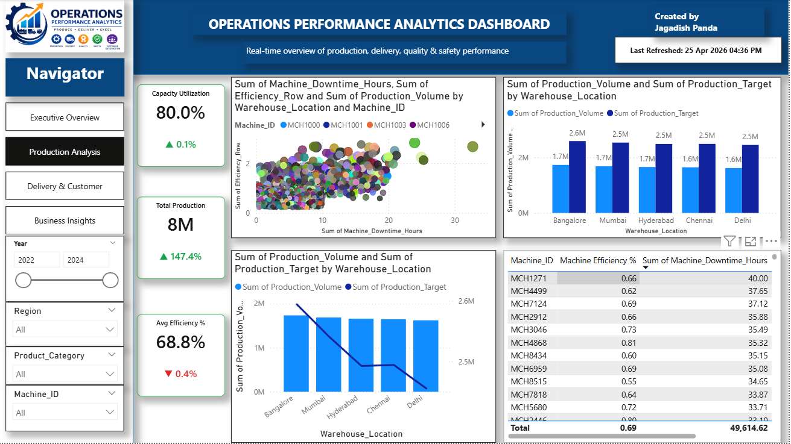
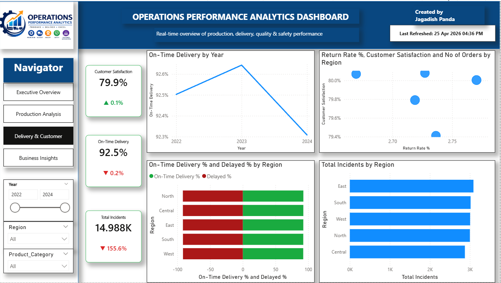
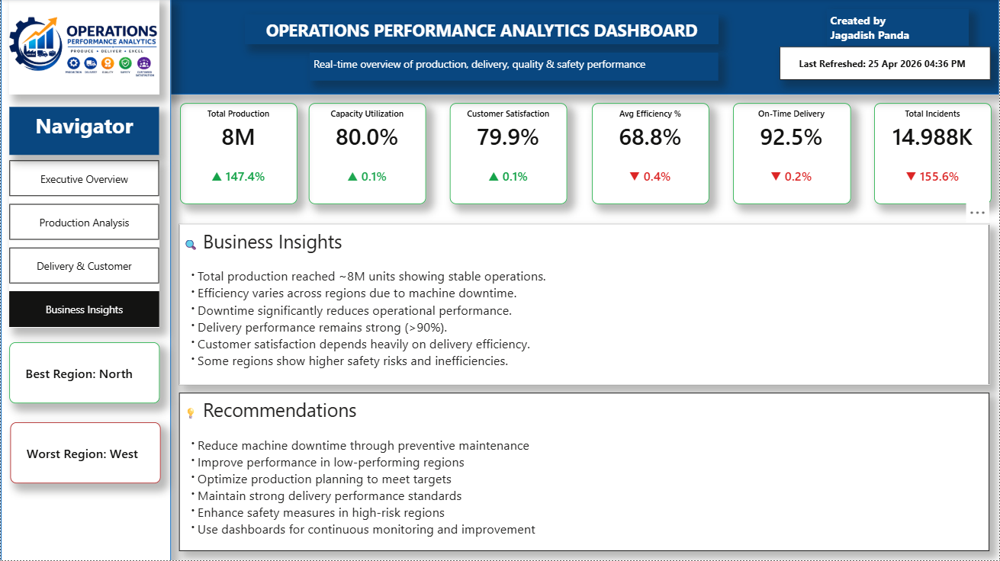

# ⚙️ Operations Performance Analytics Dashboard

A **Power BI dashboard** designed to monitor and analyze **production, delivery, efficiency, customer satisfaction, and safety metrics**. This project provides a **real-time operational overview** to help organizations improve performance, reduce downtime, and enhance decision-making.

---

## 📊 Dashboard Preview

### 🔹 Executive Overview



### 🔹 Production Analysis



### 🔹 Delivery & Customer Analysis



### 🔹 Business Insights & Recommendations



---

## 🚀 Project Overview

This dashboard provides a **complete operational analytics solution**, focusing on:

* 📦 Production performance
* 🚚 Delivery efficiency
* 😊 Customer satisfaction
* ⚙️ Machine efficiency & downtime
* ⚠️ Safety incidents

---

## 📌 Key Metrics (KPIs)

* 🏭 **Total Production:** 8M
* 📊 **Capacity Utilization:** 80.0%
* 😊 **Customer Satisfaction:** 79.9%
* ⚙️ **Avg Efficiency:** 68.8%
* 🚚 **On-Time Delivery:** 92.5%
* ⚠️ **Total Incidents:** 14.98K

---

## 📈 Features & Analysis

### 🏭 Production Analysis

* Production distribution across categories:

  * Electronics
  * Consumer Goods
  * Automotive
  * Pharmaceutical
* Year-wise production trends
* Warehouse-level production insights

---

### ⚙️ Machine Performance

* Machine efficiency vs downtime analysis
* Identifies performance bottlenecks
* Helps improve operational efficiency

---

### 🚚 Delivery Performance

* On-time vs delayed delivery comparison
* Region-wise delivery performance
* Delivery trend over time

---

### 😊 Customer Insights

* Customer satisfaction by region
* Relationship between delivery performance & satisfaction

---

### ⚠️ Safety & Incidents

* Region-wise incident analysis
* Identifies high-risk operational areas

---

## 💡 Key Insights

* 📈 Production remains stable (~8M units)
* ⚙️ Efficiency varies due to machine downtime
* 🚚 Delivery performance is strong (>90%)
* 😊 Customer satisfaction is linked to delivery efficiency
* ⚠️ Certain regions show higher safety risks

---

## ⚠️ Key Observations

* High **machine downtime reduces efficiency**
* Some regions underperform in operations
* Safety incidents impact overall performance
* Production targets are not always met

---

## 🎯 Strategic Recommendations

* ✅ Reduce machine downtime via preventive maintenance
* ✅ Improve efficiency in low-performing regions
* ✅ Optimize production planning
* ✅ Maintain strong delivery performance standards
* ✅ Enhance safety measures in high-risk regions
* ✅ Use dashboards for continuous monitoring

---

## 🧠 Business Takeaway

> Operational success depends on balancing **efficiency, delivery, and safety**.
> Data-driven insights enable organizations to improve performance and sustain growth.

---

## 🛠️ Tools & Technologies

* 📊 **Power BI** – Data Visualization
* 📂 **Excel / CSV Dataset** – Data Source
* 📈 **DAX** – KPI Calculations
* 🔄 **Power Query** – Data Transformation

---

## 📁 Project Structure

```id="ops2026"
Operations-Analytics-Dashboard/
│
├── Capstone_Dashboard.pbix
├── dataset/
│   └── operations_data.csv
├── assets/
│   ├── operations-1.png
│   ├── operations-2.png
│   ├── operations-3.png
│   └── operations-4.png
└── README.md
```

---

## 📌 How to Use

1. Download the `.pbix` file
2. Open using **Power BI Desktop**
3. Use filters:

   * Year
   * Region
   * Product Category
   * Machine ID

---

## 📎 Project Link

🔗 GitHub Repository:
(https://github.com/jagadish2003-hub/Capstone-Operational-Dashboard-Power-BI.git) *(update with repo link)*

---

## 🙋‍♂️ Author

**Jagadish Panda**
📧 [jagadishpanda2003@gmail.com](mailto:jagadishpanda2003@gmail.com)
🔗 [https://www.linkedin.com/in/jagadishpanda](https://www.linkedin.com/in/jagadishpanda)

---

## 📜 License

This project is licensed under the **MIT License**.

---

## ⭐ Support

If you like this project, give it a ⭐ on GitHub!


Just tell me 👍
